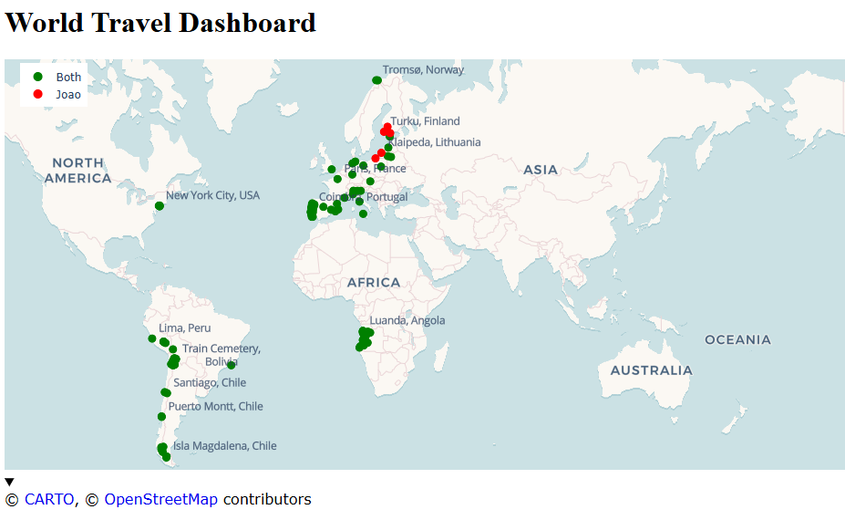

# WorldTravelMap

Dashboard of the world map with visited places.



For privacy reasons I place the python with the data content under a private submodule with:

```python
"""
Geographic waypoints that Joao and Mariana have visited
"""
__all__ = ["data"]

# Data
data = [
    # Portugal
    {"place": "Coimbra, Portugal", "lat": 40.2033, "lon": -8.4103, "visited_by": "both"},
    {"place": "Viseu, Portugal", "lat": 40.6610, "lon": -7.9097, "visited_by": "both"},
]
```
## Python

### Install packages local environment

E.g.:
```bash
python3 -m venv .venv
source .venv/bin/activate
python3 -m pip install -r requirements.txt
```

Generate requirements:
```pip3 freeze > requirements.txt ```

